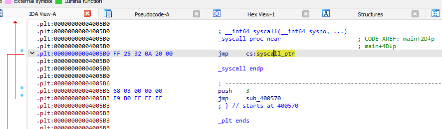
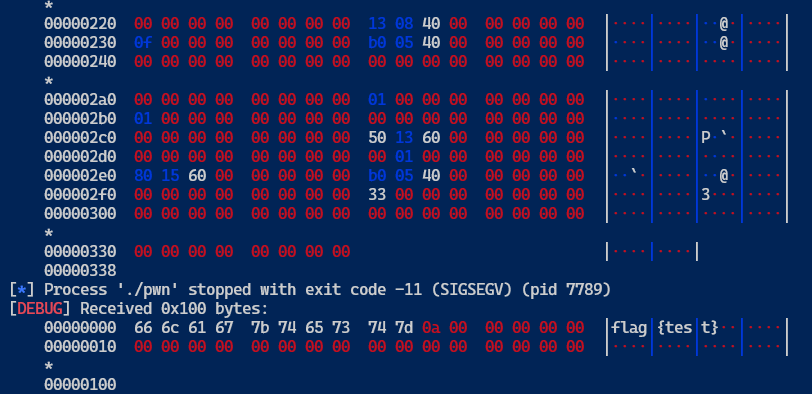

# srop

## ORW

题目附件中提供了源码，分析并查询可知，该题目通过seccomp设置了沙箱，限制了只能使用open、write、read、rt_sigreturn这几个系统调用。

[PWN-ORW总结](https://x1ng.top/2021/10/28/pwn-orw%E6%80%BB%E7%BB%93/)

## SROP

[SROP](https://ctf-wiki.org/pwn/linux/user-mode/stackoverflow/x86/advanced-rop/srop/)

## 分析过程

### 1. syscall

[syscall table](https://chromium.googlesource.com/chromiumos/docs/+/master/constants/syscalls.md)

main 函数一共4行

```c
char bd[0x30];
seccomp();
// write(1, buf, 0x30)
syscall(1,1,buf,0x30);
// read(0, bd, 0x300)
return syscall(0,0,bd,0x300);
```

先通过seccomp限制系统调用，然后两句syscall。分别先通过write输出buf的内容“welcome to NepCTF2023!”，随后用read向bd数组读入0x300长度的字符。

很明显这里的read有栈溢出。

找到syscall的地址0x4005B0


运行结果：

