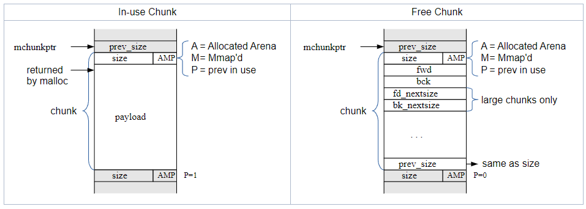

# tcmalloc vs glibc malloc (ptmalloc2)

## ptmalloc

### ptmalloc 简介

- Arena: 一个在多线程间共享的结构，其中包含一个或多个 Heap 的引用，以及这些堆中空闲的（free）Chunk 链表。每个线程会从分配给他的 Arena 中获取分配的内存。
- Heap: 被划分为多个 Chunk 的连续的内存空间，每一个 Heap 隶属于一个 Arena。
- Chunk: 可以被用于分配、释放或是与其他 Chunk 合并的一小块内存。Chunk 是分配给应用程序的一块内存的包装，每个 Chunk 存在于一个 Heap 并且属于对应的 Arena 中。

### Chunk

glibc 的 malloc 是由 Chunk 组成的，将 heap 的内存分成一个个不同大小的 Chunk。每个 Chunk 包含一些必要的元数据以及相邻块的位置。

AMP 标志

- A(0x04): Allocated Arena 内存块是否由主 Arena 分配而来
- M(0x02): mmap'd chunk 由 mmap 分配而来的内存块
- P(0x01): Previous chunk is in use 上一个 Chunk 是否在使用中



### Arenas and Heaps

为了有效地处理多线程应用程序，glibc 的 malloc 允许同时有多个内存区域处于活动状态。 因此，不同的线程可以访问不同的内存区域，而不会互相干扰。 这些内存区域称为 Arena。 有一个主 Arena，它对应于应用程序的初始堆。

随着线程冲突压力的增加，通过 mmap 创建额外的 Arena 来缓解压力。 Arena 的数量上限为系统中 CPU 数量的 8 倍。


- fast bins

fast bins仅保存很小的堆，采用单链表串联，增删chunk都发生在链表的头部，进一步提高小内存的分配效率。fast bins记录着大小以8字节递增的bin链表，一般不会和其他堆块合并。

- unsorted bin

small bins和large bins的缓冲区，用于加快分配的速度，chunk大小无尺寸限制，用户释放的堆块，会先进入unsorted bin。分配堆块时，会优先检查unsorted bin链表中是否存在合适的堆块，并进行切割并返回。

- small bins

保存大小 < 512B的chunk的bin被称为small bins。small bins每个bin之间相差8个字节，同一个small bin中的chunk具有相同大小，采用双向循环链表串联。

- large bins

保存大小 >= 512B的chunk的bin被称为large bins。large bins中的每一个bin分别包含了一个给定范围内的chunk，其中的chunk按大小降序，相同大小按时间降序。


### Thread Local Cache (tcache)

每个线程都有一个线程局部变量，用于记录上一个使用的 Arena。如果一个线程要使用 Arena 时该 Arena 正在被使用，那线程会被阻塞。

每个线程自己有一个缓存，称为 tcache。其中包含了一小部分的 Chunk，当线程使用 tcache 时不会发生阻塞。采用单向链表进行存储，类似 fast bins，区别在于 fast bins 链表指针指向 Chunk 头，而 tcache 的链表指针指向用户内存区域。


## tcmalloc

### tcmalloc 简介

tcmalloc 是 Google 用于高并发环境优化编写的内存分配器，也是 GO 内存管理的理论基础。其对于小对象内存的分配效率要优于 ptmalloc2。

tcmalloc 减少了多线程之间的锁竞争问题，对于小对象内存的分配来说，几乎没有锁竞争问题。ptmalloc2 虽然也通过 arena 来将不同的线程隔离开，但是各个 arena 之间内存无法转移归属，会造成内存使用的膨胀而造成浪费。

### tcmalloc 使用方法

可以程序链接阶段将 tcmalloc 库链接到程序上，或在程序运行前设定 LD_PRELOAD 环境变量来加载 tcmalloc。

```shell
LD_PRELOAD=/usr/lib/xxxxxxx
```

## 参考资料

[MallocInternals - glibc wiki](https://sourceware.org/glibc/wiki/MallocInternals)

[官方文档](https://gperftools.github.io/gperftools/tcmalloc.html)

[](https://blog.csdn.net/Z_Stand/article/details/121302984)

[](https://blog.csdn.net/dd18709200301/article/details/107979962)
